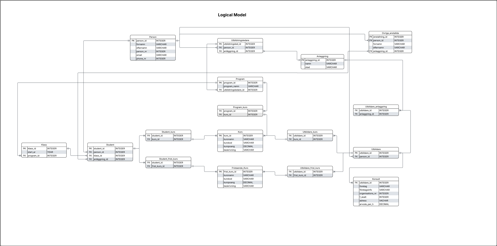

# LAB - YrkesCo

# DATAMODELLERING

## 1. Kravspecifikationer

- Studenter (förnamn, efternamn, personnummer, email)
- Utbildare (fast anställda och konsulter)
- Utbildningsledare (personuppgifter)
- En utbildningsledare måste ha hand om ett program
- En student måste ingå i en kurs eller ett program
- En utbildare kan ha en eller flera kurser
- En utbildningsledare har hand om 2 program
- Kurser - (namn, kurskod, kurspoäng, kort beskrivning)
- En kurs kan vara fristående eller ingå i ett program
- Ett program har 3 olika startår / klasser
- Konsulter - (företag, företagsinfo, organisationsnummer, F-skatt, adress och arvode/h)
- YrkesCo har 2 anläggningar (Gbg och Sthlm)
- Känsliga uppgifter / Personuppgifter är inte synligt för alla i organisationen
- Övriga anställda - här ingår övriga roller på YrkesCo - (Admin, VD, utbildningschef, teamleader, ekonomiansvarig, ledningsgrupper, kommunikationsansvariga)

## 2. Relationship Statements

### Student

- En student är kopplad till en och endast en anläggning
- En student kan delta i en eller många kurser
- En student tillhör en och endast en klass
- En klass har många studenter

### Klass

- En klass tillhör ett och endast ett program
- Ett program har en eller många klasser
- En klass har många studenter

### Utbildare

- En utbildare har en eller många kurser
- En utbildare kan vara undervisa på en eller många anläggningar

### Konsult

- En utbildare kan vara en eller många konsulter
- En konsult kan vara en och endast en utbildare

### Utbildningsledare

- En utbildningsledare ansvarar för många program (2 olika program)
- Ett program har en och endast en utbildningsledare
- En utbildningsledare tillhör en och endast en anläggning

### Anläggning

- En anläggning har många studenter
- En anläggning har många utbildare
- En anläggning har många utbildningsledare
- En anläggning har många övriga anställda

### Kurs

- Ett program kan ha många kurser
- En kurs undervisas av en eller många utbildare
- En kurs har många studenter

### Program

- Ett program har en eller många klasser (3 startår/klasser)
- Ett program består av många kurser
- Ett program har många studenter

### Övriga anställda

- En anställd är kopplad till en och endast en anläggning

## 3. Conceptual Data Model (CDM)

### 3.1 Specificering av relations-etiketter

- En klass _tillhör_ program
- En student _tillhör_ klass
- En student _tillhör_ kurs
- En utbildningsledare _ansvarar_ för program
- En utbildningsledare är _kopplad till_ anläggningingar
- En kurs _ingår_ i ett program
- En kurs _undervisas_ av utbildare
- En utbildare _kan vara_ konsult
- En utbildare är _kopplad till_ anläggningingar
- Övriga anställda är _kopplad till_ anläggningar
- En student är kopplad till anläggningar

## 4. Logical Data Model (LDM)

## 5. Physical Model - ER‑diagram (grafiskt)

- The dbml code can be found in - physical_model.dbml

## 6. 3NF

## 7. Förbättringar

Utifrån kravspecifikationerna hade förbättringar kunnat adderas vid tillfälle. Exempel på förbättringsområden:

- Studenters **behörighet**
- **Övriga anställda** - utveckla personlig information, deras avdelningar och organisations-kopplingar till YrkesCo.

# IMPLEMENTATION
